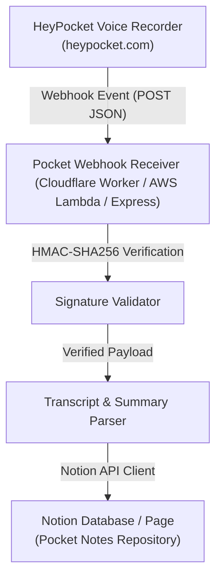

# Pocket to Notion Sync Engine (`pocket-notion`)

## 📌 Architecture & Overview

The `pocket-notion` project is an open-source, automated integration bridge designed to synchronize voice recordings, AI transcripts, action items, and summaries from [HeyPocket](https://heypocket.com) (or [Pocket AI](https://heypocketai.com)) directly into a structured [Notion](https://www.notion.so) database or parent page.

## 🛠️ Technology Stack & Architecture

- **Runtime**: [TypeScript](https://www.typescriptlang.org) / [Node.js](https://nodejs.org) (Node.js 20.x on [AWS Lambda](https://aws.amazon.com/lambda/) & [Cloudflare Workers](https://workers.cloudflare.com))
- **API Ingestion**: [Amazon API Gateway HTTP API](https://aws.amazon.com/api-gateway/) / [Cloudflare Workers](https://workers.cloudflare.com)
- **Custom Domain**: Supported via [Amazon Route 53](https://aws.amazon.com/route53/) + [AWS Certificate Manager](https://aws.amazon.com/certificate-manager/) or Cloudflare Edge DNS
- **Notion Target**: Notion Database or Parent Page

## 🔒 Security & Environment Variables

Credentials are stored securely in environment variables (or AWS Secrets / Cloudflare Secrets):
- `NOTION_API_KEY`: Internal integration token from Notion (`ntn_...` or `secret_...`).
- `NOTION_DATABASE_ID`: Target Notion page or database 32-character ID.
- `HEYPOCKET_WEBHOOK_SECRET`: Optional HMAC signing secret.

---
*Vibe-coded by Antigravity v2.0 on 2026-08-13. Driven by @dt1900.*
