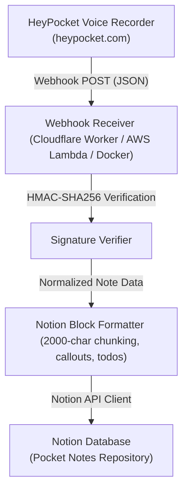

# Pocket to Notion Sync Engine

An automated, open-source integration bridge designed to automatically synchronize voice notes, AI summaries, action items, and transcripts from [HeyPocket](https://heypocket.com) (or [Pocket AI](https://heypocketai.com)) directly into a structured [Notion](https://www.notion.so) database.



---

## ✨ Features

- **🎙️ Automatic Voice Note Ingestion**: Triggers immediately whenever HeyPocket completes processing a recording or transcript.
- **✨ Rich Notion Page Formatting**:
  - **AI Summary Callout**: Highlighted summary and key takeaways.
  - **Interactive Action Items**: Formatted as Notion `to_do` blocks with assignee and due date metadata.
  - **Structured Mind Map**: Formatted as bulleted lists.
  - **Full Transcript**: Multi-speaker format with automatic 2,000-character block chunking to prevent Notion API payload limits.
  - **Audio Bookmark & Metadata**: Direct link to the audio recording, recording duration, and timestamps.
- **🛡️ Deduplication & Updates**: Automatically matches existing notes by Pocket ID to avoid duplicate pages.
- **💸 Zero-Cost Hosting**:
  - **[Cloudflare Workers](https://workers.cloudflare.com) (Recommended Free Tier)**: 100,000 requests per day for free, global low-latency edge, zero server maintenance.
  - **[AWS Lambda](https://aws.amazon.com/lambda/)**: Free tier (1M invocations/month) with Function URLs.
  - **Standalone [Node.js](https://nodejs.org) / [Docker](https://www.docker.com)**: Run on any self-hosted server or container.
- **🔐 Secure HMAC Verification**: Validates incoming `X-HeyPocket-Signature` to protect against unauthorized webhook spam.

---

## 🚀 Quick Start (5 Minutes)

### Step 1: Clone and Run Interactive Setup

Clone the repository and run the setup wizard:

```bash
git clone https://github.com/dt1900/pocket-notion.git
cd pocket-notion
npm install
npm run setup
```

The interactive wizard will:
1. Prompt for your [Notion](https://www.notion.so) Integration Secret Token (`secret_...` or `ntn_...`).
2. Prompt for your Notion Database ID.
3. Automatically test and verify your Notion connection.
4. Save the configuration to `.env`.

---

### Step 2: Set Up Your Notion Database & Integration

#### 1. Create a Notion Internal Integration
1. Visit the [Notion Integrations Portal](https://www.notion.so/profile/integrations).
2. Click **+ New integration**.
3. Name it `Pocket Sync`, select your workspace, and set capabilities to **Read content**, **Update content**, and **Insert content**.
4. Copy the **Internal Integration Secret** (`ntn_...` or `secret_...`).

#### 2. Create and Share a Notion Database
1. In Notion, create a new database (or duplicate an existing table).
2. Recommended database columns (all optional, the sync engine adapts to whatever columns exist):
   - `Name` / `Title` (Title property)
   - `Date` (Date property)
   - `Tags` (Multi-select property)
   - `Audio` (URL property)
   - `Pocket ID` (Text / Rich Text property)
3. Click the `...` menu in the top-right corner of your Notion database page.
4. Scroll to **Connections** / **Connect to**, search for `Pocket Sync`, and confirm access.
5. Copy your database ID from the database URL:
   `https://www.notion.so/{workspace_name}/{DATABASE_ID}?v=...` (the 32-character alphanumeric string before `?v=`).

---

### Step 3: Deploy for Free

#### Option A: Cloudflare Workers (100% Free Forever - Recommended)

```bash
# 1. Login to Cloudflare
npx wrangler login

# 2. Store your Notion secrets in Cloudflare Workers
npx wrangler secret put NOTION_API_KEY
npx wrangler secret put NOTION_DATABASE_ID
npx wrangler secret put HEYPOCKET_WEBHOOK_SECRET  # Optional

# 3. Deploy
npm run deploy:cf
```

Wrangler will output your live URL, for example:
`https://pocket-notion-sync.<your-subdomain>.workers.dev`

---

#### Option B: AWS Lambda (Zero-Cost with Free Tier)

Deploy with [AWS Serverless Application Model (SAM)](https://aws.amazon.com/serverless/sam/):

```bash
npm run deploy:aws
```

SAM will prompt you for your `NotionApiKey` and `NotionDatabaseId`, create the Lambda function with a public Function URL, and output your live endpoint URL.

---

#### Option C: Standalone Server / Docker

```bash
# Start locally
npm run dev

# Or with Docker
docker build -t pocket-notion .
docker run -p 3000:3000 --env-file .env pocket-notion
```

---

### Step 4: Configure HeyPocket Webhook

1. Open the [HeyPocket](https://heypocket.com) mobile application (or Pocket Web Dashboard).
2. Navigate to **Settings** -> **Integrations** -> **Personal Webhooks** (or Custom Webhook).
3. Set the Webhook URL to:
   - For Cloudflare / AWS: `https://your-deployment-url/`
   - For Standalone Server: `https://your-domain.com/webhook`
4. If HeyPocket provides a **Signing Secret**, copy it and set it as `HEYPOCKET_WEBHOOK_SECRET` in your environment.
5. Record a test voice note on your Pocket device — within seconds, your note, transcript, summary, and action items will sync into Notion.

---

## 🧪 Testing Locally

You can test the entire pipeline locally without waiting for a physical voice recording:

```bash
# Terminal 1: Start local server
npm run dev

# Terminal 2: Send simulated HeyPocket webhook payload
npm run test:webhook
```

To run the unit test suite:

```bash
npm test
```

---

## 📁 Repository Structure

```
pocket-notion/
├── src/
│   ├── types/          # HeyPocket & Notion TypeScript interfaces
│   ├── services/
│   │   ├── verifier.ts    # HMAC-SHA256 signature verification
│   │   ├── normalizer.ts  # Payload normalization & extractor
│   │   ├── notion.ts      # Notion API client & block formatting
│   │   └── sync.ts        # Main webhook sync controller
│   └── adapters/
│       ├── cloudflare.ts  # Cloudflare Workers edge handler
│       ├── lambda.ts      # AWS Lambda serverless handler
│       └── standalone.ts  # Standalone Node.js HTTP server
├── scripts/
│   ├── setup.ts        # Interactive setup wizard CLI
│   └── test-webhook.ts # Mock HeyPocket webhook generator
├── tests/              # Unit & integration tests
├── wrangler.toml       # Cloudflare Workers configuration
├── template.yaml       # AWS SAM deployment template
├── Dockerfile          # Containerized deployment
└── README.md
```

---
*Vibe-coded by Antigravity v2.0 on 2026-08-13. Driven by @dt1900.*
